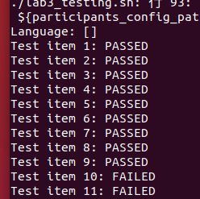

# CloudComputingLab3

摸fish组 组员：蔡俊祺，周亚男，伍佳伟，张宇

### 文件说明

主要代码：

main.cpp, Coordinator.h, Coordinator.cpp, Participant.h, Participant.cpp, 

MessageProcessor.h, MessageProcessor.cpp, Makefile


### 代码运行方法

```bash
make
./kvstore2pcsystem --config_path [config_path]
```


### 运行成功后输出

```
Coordinator/Participant in xxx.xxx.xxx.xxx:xxx start listening...
```


### 脚本测试结果

环境：Ubuntu 18.04 x64



通过前9项测试，实现了advanced version

